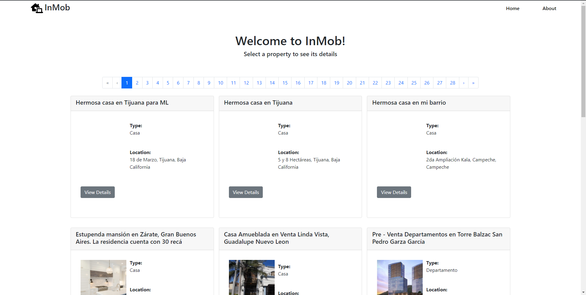
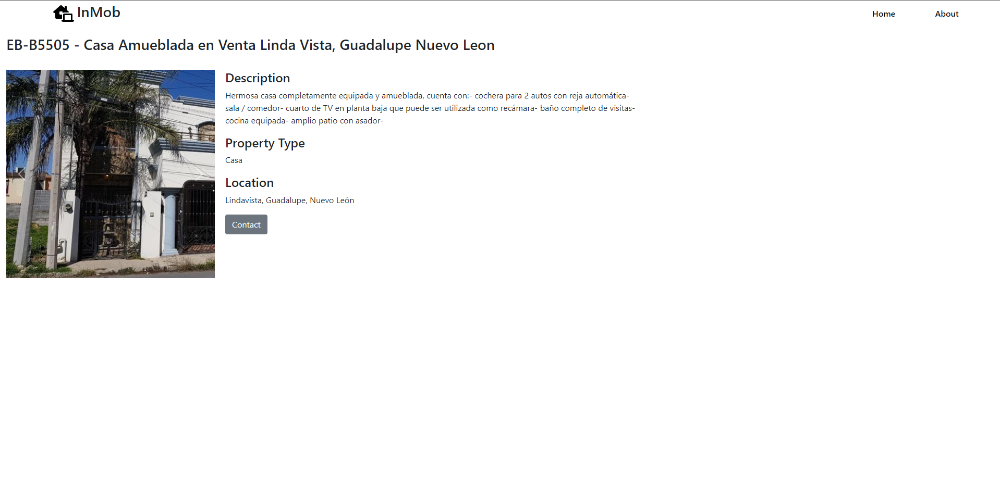
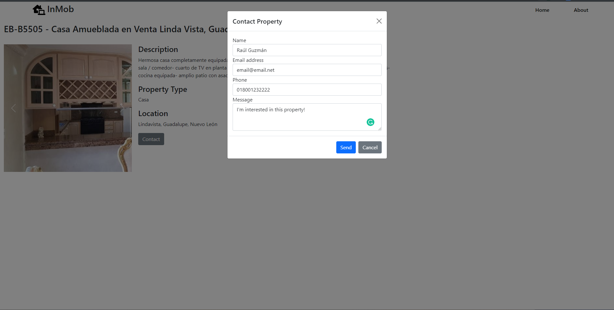

# InMob

InMob is a brand new platform to checkout available properties near you! Made using EasyBroker's API.

## What can you do in InMob?

### Check out properties near you!

### View details about properties!

### Contact the property's owner!

## How do you get InMob running?
This repository is for InMob's frontend. To get this project running:
1. Clone the repository
1. Install the dependencies using `npm install`
1. Replace the placeholder environment variables in `example.env` with your own
1. To quickly checkout the project, run `npm run dev`. You can also run `npm run build` to build the project for production.

The repository that contains the backend is [here](https://github.com/rguzg/InMobBackend)

To get the backend running:
1. Clone the repository
1. Install the dependencies using `npm install`
1. Replace the placeholder environment variables in `example.env` with your own
1. To quickly checkout the project, run `npm run dev`. You can also run `npm run build` to build the project for production and `npm start` to run the project's compiled version.

## Design Notes
The main thing I want to point out about InMob is its architecture. InMob was originally supposed to have a three tier architecture. The first tier was the frontend, made with SvelteKit, the second one was a TypeScript interface to the EasyBroker API, and the third one was the actual EasyBroker API. I had chosen this architecture because it'd have been easier to get data to the frontend by using an OOP approach, instead of having the API calls in the frontend, but I realized to late that the TS interface wouldn't have worked for the frontend. The EasyBroker API's CORS policy didn't allow any domain to access the API, so sending requests from the browser wouldn't have worked.

Taking that into account, the architecture ended up being four tiered:
1. Frontend: SvelteKit. Using SvelteKit's endpoint functionality, some of the OOPness was kept. 
1. Backend: Exposes a custom API to the frontend. Uses the EasyBroker TS interface to talk to the EasyBroker API.
1. EasyBroker TS Interface: TypeScript interface to the EasyBroker API.
1. EasyBroker API

There're better ways of creating a typed OOP interface in JavaScript that a frontend can consume, like using LoopBack (pretty much merging point 2 and 3 of the current architecture) but due to time constraints, the current architecture was kept.

As a side note, the EasyBroker TS interface is a separate npm package, which can be checked out [here](https://www.npmjs.com/package/easybrokerapi). One silver lining of making the EasyBroker TS interface separate (as well as exporting the types the interface uses) is that the types can be used to provide type safety to the frontend.

Another side effect of the project's architecture is that the API key is stored in the frontend instead of the backend which is bad, but due to time constraints it was kept on the frontend. There could've been three ways of tackling the "where do we put the API key" problem:
1. Store it in the frontend. This allows some sort of authentication with the backend because if the API key isn't sent, the backend won't be able to use the EasyBroker TS Interface. Not the best solution, but the quickest one
1. Store it in the backend, and create an auth procedure between the frontend and the backend, perhaps using a JWT. The better solution, but more time consuming.
1. Store it in the backend, but don't create an auth procedure between the frontend and the backend. The quick and bad solution, because anyone that had access to the API could use it to interface directly with the EasyBroker TS interface.

While I feel like the interface and backend code is fairly clean (ignoring how that approach wasn't the best), the frontend code is messier. There're several places where I feel some code smell but due to time constraints I couldn't fix those issues. An example of that is how the `properties/{id}` endpoint handles an unknown property ID. Right now, to get an specific property from the frontend, you call `getPrpertyByID.get(id: string): Promise<GetPropertyByIDResponse> `. If the call to the backend returns a response different than 2XX, the promise is rejected. The frontend catches the promise rejection and shows a message to the user that implies that the ID is invalid, the problem here is that a promise rejection doesn't always mean that the API call returned a 404, so the might be getting confusing error messages. The solution to this would've been to use SvelteKit's `load` interface. This interface allows data to be fetched server-side and in the interface returns nothing, SvelteKit's router falls through the rest of the routes until it gets to the 404 page.

Finally, if I'd had more time, I probably would've made the frontend nicer, added proper error handling to the ContactForm component, as well as showing actual error messages on the ContactForm component and Dockerizing the project.